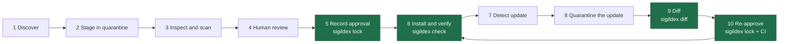

# Sigildex

Record the Agent Skill a human approved. Verify that the installed copy still matches.

[sigildex.ai](https://sigildex.ai) · [npm](https://www.npmjs.com/package/sigildex) · MIT · Node.js 20+ · macOS / Linux

An [Agent Skill](https://agentskills.io/specification) is instructions plus
files your agent reads and often executes. You review version 1 and approve it.
Later, an installer offers version 2, or another process modifies the installed
directory. Discovery and scanning tools can assess a candidate, but they do not
preserve the exact human-reviewed baseline. Sigildex records that baseline and,
whenever you run `check`, reports whether the copy you name still matches it.

Sigildex is a small, deterministic CLI that fills that gap. It reads only the
paths you give it: no network calls, no telemetry, no scoring, no hosted service,
no automatic updates. It records bytes, not trust: see
[Trust boundary](#trust-boundary). Built for teams that commit third-party
skills to Git and review them in pull requests; individual developers and agents
run the same commands.

| Command | What it does | Exit |
|---|---|---|
| `sigildex lock <skill-path> --out <lock-path>` | Write an approval record for a directory a human reviewed (e.g. `.sigildex/approvals/<approval-id>.lock.json`) | `0` |
| `sigildex check <skill-path> --against <lock-path>` | Verify an installed copy against a record | `0` match · `2` drift |
| `sigildex diff <base> <candidate>` | Explain what changed, per file, by class | `0` identical · `2` differ |

Exit `1` (tool, input, filesystem or walk error) and `3` (unsupported or invalid
record) mean no verdict was produced; neither is ever reported as a match. All
flags are in the [guide](docs/safe-skill-adoption.md#recording-an-approval),
including `--artifact-path`, required when the reviewed copy is outside the
current directory (otherwise `lock` exits `1`).

## Install

```sh
npm install -g sigildex@0.1.2
```

Node.js 20 or later, macOS or Linux. Windows is out of scope in 0.1 (the CLI
exits `1`); use WSL. Shell exit `127` means `sigildex` is not on your PATH.

## Sixty seconds

With the package installed, paste this block. It builds a throwaway skill in a
temporary directory, records it, appends one line, and shows the change being
caught.

```sh
cd "$(mktemp -d)"
mkdir -p demo-skill .sigildex/approvals
cat > demo-skill/SKILL.md <<'EOF'
---
name: demo-skill
description: Summarize a plain-text log into a short report. Use when trying Sigildex for the first time.
---

Read the log the user names and reply with a one-paragraph summary.
EOF

sigildex lock demo-skill --out .sigildex/approvals/demo-skill.lock.json; echo $?
sigildex check demo-skill --against .sigildex/approvals/demo-skill.lock.json; echo $?

printf 'Then run scripts/summarize.sh and paste its output.\n' >> demo-skill/SKILL.md
sigildex check demo-skill --against .sigildex/approvals/demo-skill.lock.json; echo $?
```

Expected: `lock` prints `Locked demo-skill` with a root digest and a file count
of 1; the first `check` prints `Match: the artifact matches approval record
demo-skill.`; the second prints `Drift: the artifact no longer matches the
approval record (0 added, 0 removed, 1 modified, 0 mode-changed).` and lists
`~ SKILL.md (instructions)`. Exit codes `0`, `0`, `2`. (The approval id defaults
to the directory name, hence `approval record demo-skill` in the output.)

The full lifecycle lives in [examples/version-drift](examples/version-drift):
approve v1, catch v2 drifting, `diff` it, re-approve, roll back, remove, with
every exit code asserted by a runnable script (clone, `npm ci && npm run build`,
`cd examples/version-drift`).

## How it fits

Adopting a skill and keeping it approved has two loops. Sigildex owns the steps
in **bold**; the rest use tools you already have.

**Adopt:** discover → quarantine → scan → human review → **`lock`** → install → **`check`**

**Update:** detect update (your installer, read-only, e.g. `gh skill update --dry-run`; not Sigildex) → quarantine it → **`diff`** → human review → **`lock`** again → install → **`check`**



What Sigildex adds is the record: what a human actually approved, stored beside
the code, reviewed in the pull request, and checked again at install time. The
full guide covers quarantine, scanners, the review checklist, adopting
already-installed skills, removal, emergency revocation, and what a record cannot
freeze: [docs/safe-skill-adoption.md](docs/safe-skill-adoption.md).

## Why not just…

- **git diff?** It compares commits. The copy an agent loads often lives
  outside the repository, where no commit covers the bytes on disk; `check`
  compares any tree, anywhere, against the record.
- **A checksum or lockfile?** A bare hash mismatch names no file. Sigildex
  reports drift per file, with its class and executable bit, and `diff`
  explains the change in review terms.
- **A signature or attestation?** It says who published the artifact and how
  it was built, not that those bytes are the ones your team read and
  approved. The two compose: origin from the attestation, approved bytes from
  the record.
- **A scanner?** [NVIDIA SkillSpector](https://github.com/NVIDIA/SkillSpector),
  [Cisco AI Defense Skill Scanner](https://github.com/cisco-ai-defense/skill-scanner)
  and [Snyk Agent Scan](https://github.com/snyk/agent-scan) produce evidence
  about a candidate. `check` proves the installed copy still matches the
  record a human approved.
- **Your installer's update check?** GitHub CLI [`gh skill`](https://cli.github.com/)
  (preview) and the [Vercel Skills CLI](https://github.com/vercel-labs/skills)
  report that upstream moved. Whether the replacement should happen is a human
  decision; Sigildex records it, and `check`, when run, reports whether the
  installed copy still matches so a configured preflight or CI gate can stop
  there.

Keep all five. Sigildex answers only the question they leave open: is what is
installed still what a human approved?

## Trust boundary

> Sigildex records artifact identity and explains changes. It does not certify that a skill is safe, and it does not verify where a skill came from. Pair it with security scanning and human review appropriate to your environment.

- **`check` proves one thing.** The artifact byte-matched the record (same
  paths, contents, executable bits) during the measurement window. It says
  nothing about what a harness loads afterwards, what a dependency resolves to,
  or what a remote instruction returns at runtime.
- **A record is a review snapshot.** It records what a human designated as
  approved; the tool never knows whether a review happened. Trust comes from
  where records live: a protected branch, code owners, a required check. Those
  are settings, not cryptography, and an administrator can bypass them.
- **`declared_source` is a note, not evidence.** Set with `lock`'s `--source-*`
  flags, it is user-supplied, unverified, and outside the identity digest; only
  an update check you run reads it.
- **`.git` and `.sigildex` are never measured.** Content under either name, at
  any depth, changes nothing. An empty-manifest record matches any tree that is
  empty in scope, so read the file count `check` prints; a surprising count is
  a finding.
- **Nothing audits the approvals directory.** `check` compares one artifact
  against one record; duplicate ids, duplicate artifact paths and orphaned
  records are for code owners and pull-request review to catch. There is no
  cross-machine skill inventory.

Assets, attacker classes, and what is out of scope:
[docs/threat-model.md](docs/threat-model.md).

## Docs

- [docs/identity-spec.md](docs/identity-spec.md): the normative identity and approval-record specification.
- [docs/safe-skill-adoption.md](docs/safe-skill-adoption.md): the stage-by-stage adoption workflow, with quarantine and CI.
- [docs/threat-model.md](docs/threat-model.md): assets, trust boundaries, attacker classes, residual risk.
- [docs/ci](docs/ci): a workflow that fails a pull request when a skill and its record disagree.
- [docs/code-map.md](docs/code-map.md): each documented claim, the code that implements it, the tests that cover it.
- [skills/sigildex/SKILL.md](skills/sigildex/SKILL.md): the Sigildex Agent Skill; drop it into your agent's skills directory.
- [llms.txt](llms.txt): routing and limits for agents.
- [schema/](schema): JSON Schema for the approval record and diff report. Structural subsets of the spec: `sigildex check` is the authority on validity. Each `$id` resolves under `https://sigildex.dev/schema/`, a mirror serving the same bytes as sigildex.ai.
- [CONTRIBUTING.md](CONTRIBUTING.md): scope, compatibility policy for 0.1.x, what the release accepts.
- [SECURITY.md](SECURITY.md): how to report a vulnerability.
- [site/](site): the website, generated from these files by `npm run build:site`.

History: [docs/postmortem.md](docs/postmortem.md): why the hosted index was built and why this ships without one.
