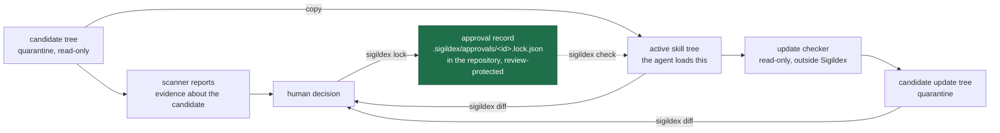
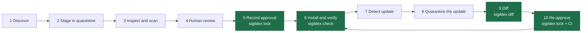

# Sigildex

Record what a human approved in an Agent Skill. Detect when it changes.

[sigildex.ai](https://sigildex.ai) · [sigildex on npm](https://www.npmjs.com/package/sigildex)

An [Agent Skill](https://agentskills.io/specification) is instructions plus
files your agent will read and, often, execute. You review version 1 and
approve it. Upstream ships version 2: it adds an executable script and rewrites
the instructions to call it. Nothing in the install path tells you. Discovery
tools find skills, scanners produce evidence about a candidate, and a human
decides — but none of them remembers what you approved, or notices when the
installed bytes stop matching it.

Sigildex is a local, deterministic command-line tool that closes that gap.
`sigildex lock` records an approval baseline for a skill directory you have
reviewed, `sigildex check` detects drift in the bytes it measured, and
`sigildex diff` explains what changed between two versions. It operates on local
paths only: no network calls, no telemetry, no safety scoring. Sigildex
complements security scanners; it does not certify that a skill is safe.
There is no hosted index, no discovery API, and no publisher-monitoring service.

> Sigildex does not replace discovery, security scanning, or human review. It connects them into a durable workflow by recording exactly what was approved and detecting when that artifact changes.

It is built first for teams that review third-party Agent Skills and commit them
to a Git repository, where the approval record travels through pull request
review with the skill it describes. Individual developers running agents, and
agents themselves, are the secondary path; both run the same commands.

## Install

```sh
npm install -g sigildex@0.1.1
```

Requires Node.js 20 or later, on macOS or Linux. Windows is out of scope in
v0.1; the CLI exits `1` there. Run it under WSL or on a macOS or Linux host. If
your shell reports exit `127` for `sigildex`, the command is not on your PATH —
that is a shell error, not a Sigildex verdict.

The sixty-second path below needs nothing else. The full walkthrough after it
uses example trees that ship in the repository, not in the npm package, so that
path runs from a clone:

```sh
git clone https://github.com/sigildex/sigildex
cd sigildex
npm ci && npm run build
```

## The workflow

Adopting a skill has ten stages. Sigildex's commands do the work in four of
them; the other six are documented here and done with other tools.

Those stages move a small number of objects between three places: a quarantine
directory, your repository, and the directory your agent actually loads from.



The filled box is the artifact Sigildex produces. The record is a reviewed
baseline, not an attestation: it says what was designated as approved, not that
the artifact is safe, that it came from where it claims, or that the
designation was a person rather than a process — your repository's review
controls hold that in place.
Sigildex never discovers updates itself — the update checker is a separate tool
you run, on demand or on a schedule you own.

The same ten stages, as a sequence:



The filled stages are the four a Sigildex command does the work in.

| # | Stage | Who or what does it | Sigildex's role |
|---|---|---|---|
| 1 | Discover | Discovery tools: the GitHub CLI's [`gh skill`](https://cli.github.com/) (preview), the [Vercel Skills CLI](https://github.com/vercel-labs/skills), publisher catalogs | — |
| 2 | Stage | You copy the candidate into a quarantine directory outside every active skills directory, record where it came from, and run nothing bundled with it | Documented; the Agent Skill instructs the agent to do this |
| 3 | Inspect and scan | Scanners: [NVIDIA SkillSpector](https://github.com/NVIDIA/SkillSpector), the [Cisco AI Defense Skill Scanner](https://github.com/cisco-ai-defense/skill-scanner), [Snyk Agent Scan](https://github.com/snyk/agent-scan). They produce evidence, not certification. Plus the manual review checklist | — |
| 4 | Human review | A person reads the skill and decides | — |
| 5 | Record approval | `sigildex lock` writes `.sigildex/approvals/<approval-id>.lock.json` | **`sigildex lock`** |
| 6 | Install and verify | Copy to the active skills directory, then check the copy that will actually run; a mismatch exits `2`, and your preflight or CI gate stops there | **`sigildex check`** |
| 7 | Detect update | Read-only checks such as [`gh skill update --dry-run`](https://cli.github.com/manual/gh_skill_update) (GitHub CLI 2.90.0 or newer) or a package-manager dry run, on demand or on a schedule you own. Never automatic | Documented |
| 8 | Quarantine the update | Stage the candidate update outside the active installation, which stays untouched | Documented; the Agent Skill instructs the agent to do this |
| 9 | Diff | `sigildex diff old new` reports what changed, per file, by class | **`sigildex diff`** |
| 10 | Re-approve | A human reads the diff and locks a new baseline; [CI](docs/ci), `CODEOWNERS`, and branch protection keep the decision human | **`sigildex lock`** plus repository controls |

The other six stages already have tools that do them well, and an installer can
even tell you when upstream has moved. Hashing a skill directory is not a new
idea either, and several small projects do it. What Sigildex adds is the
connective tissue: a durable, deterministic, reviewable record of *what a human
actually approved*, stored beside the code, checked in review, and checked again
at install time. Use them together with this.

The full guide, including adopting already-installed skills, removal and
emergency revocation, and the explicit limits of what an approval record cannot
freeze, is in [docs/safe-skill-adoption.md](docs/safe-skill-adoption.md).

## Why not just…

Five things already in most workflows answer a nearby question. None of them
answers this one.

| What you already have | What it answers | What it does not | With Sigildex |
|---|---|---|---|
| Git diff | What changed between two commits, and what a reviewer saw in the pull request that carried it. `git diff --exit-code <commit> -- <path>` can even gate on the working tree | Follow the skill out of the repository: the copy an agent loads often lives in another directory, another checkout, or another machine, where no commit covers the bytes on disk | The record is one file that travels: `check` compares any tree, anywhere, against it — with defined exclusions, executable bits, and exit codes |
| A checksum or package lockfile | That a named archive or coordinate resolves to the bytes you pinned; a hand-rolled manifest can go file by file | What changed when the check fails — a bare hash mismatch names no file and explains nothing | Drift is reported per file, with its class and executable bit, and `diff` explains the change in review terms |
| A signature or provenance attestation | Who published the artifact and, increasingly, how it was built | Say whether those bytes are the ones your team read and approved | The record names the exact bytes a reviewer designated — a claim held in place by your repository's review controls, not by the tool. The two compose: origin from the attestation, the reviewed baseline from the record |
| A security scanner | Evidence about a candidate: risky patterns, known indicators, policy violations | Establish that the copy running later is byte-identical to the copy the evidence was gathered about | Scan the candidate, approve it, then `check` that what is installed is still that candidate |
| Your installer's update check | That upstream has moved, and usually what it moved to | Decide whether the replacement should happen, or leave a reviewable record of that decision where your PR process can require a human to approve it | Quarantine the update, `diff` it against the approved tree, and lock a new baseline once it has been read |

Keep all five: Sigildex answers only the question they leave open, which is
whether what is installed is still what a human approved.

## Five minutes

### Sixty seconds, with the installed package

With the package installed as above, this block needs nothing else. It builds a
throwaway skill in a temporary directory, records it, appends one line, and
shows the change being caught. Paste the whole block.

```sh
cd "$(mktemp -d)"
mkdir -p demo-skill .sigildex/approvals
cat > demo-skill/SKILL.md <<'EOF'
---
name: demo-skill
description: Summarize a plain-text log into a short report. Use when trying Sigildex for the first time.
---

Read the log the user names and reply with a one-paragraph summary.
EOF

sigildex lock demo-skill --out .sigildex/approvals/demo-skill.lock.json; echo $?
sigildex check demo-skill --against .sigildex/approvals/demo-skill.lock.json; echo $?

printf 'Then run scripts/summarize.sh and paste its output.\n' >> demo-skill/SKILL.md
sigildex check demo-skill --against .sigildex/approvals/demo-skill.lock.json; echo $?
```

`lock` prints `Locked demo-skill` with a root digest, a file count of 1, and the
frontmatter it read. The first `check` prints `Match: the artifact matches
approval record demo-skill.` The second prints `Drift: the artifact no longer
matches the approval record (0 added, 0 removed, 1 modified, 0 mode-changed).`
and lists `~ SKILL.md (instructions)`. The three `echo $?` lines are `0`, `0`,
and `2`.

No approval id is passed, so it is derived from the directory name, which is why
`--out` is `demo-skill.lock.json`. The temporary directory holds nothing else,
and nothing outside it is touched.

### The full walkthrough, from a clone

Run this from the clone above:

```sh
cd examples/version-drift
```

The commands below call `npx sigildex`, which inside the clone runs the build
you just made. With the published package installed globally, every command is
the same without the `npx` prefix; the clone is still where the example trees
live.

**Record what you reviewed.** `skill-v1` stands in for a candidate you have
staged in quarantine and read.

```sh
mkdir -p .sigildex/approvals
npx sigildex lock skill-v1 \
  --approval-id log-summarizer \
  --out .sigildex/approvals/log-summarizer.lock.json \
  --source-kind git \
  --source-repository https://github.com/example-org/example-skills \
  --source-path skills/log-summarizer \
  --source-commit 4f2a9c1 \
  --source-tracking track-default-branch
```

```
Locked skill-v1
  approval id:            log-summarizer
  root digest:            sha256:d445576462862500bd9537c93fc2390802d97bf3df13879a9b83cc21e04890ad
  files:                  2
  frontmatter:            ok
    name:                 log-summarizer
    description:          Summarize a plain-text application log into a short incident report — error counts, the first and last timestamp seen, and the most frequent messages. Use when …
  written to:             .sigildex/approvals/log-summarizer.lock.json
This records byte identity only. It does not attest safety, provenance, or future content.
```

Exit `0`.

Notes on the flags:

- `--out` is required, and its filename is always `<approval-id>.lock.json`.
  `lock` refuses to write under any other name, so a record it writes can never
  disagree with its own id. `check` does not re-check that: it reads whatever
  record `--against` points at, under whatever path, and compares the artifact
  to it as-is. The invariant is enforced where records are *written*, not where
  they are *used*, so keeping the store's naming honest is a review
  responsibility.
- `--approval-id` is optional. It defaults to a value derived from the skill
  directory's name; pass it explicitly for an id that does not depend on what
  the directory happens to be called. When the derived value would not match
  `[a-z0-9][a-z0-9-]{0,63}`, `lock` exits `1` and asks for the flag rather than
  guessing.
- `--artifact-path` records the project-relative location the artifact will
  occupy, and defaults to the skill path relative to the current directory.
  Locking a directory whose path, as given on the command line, lies outside the
  current directory without `--artifact-path` exits `1` and says so — the usual
  case when you lock a quarantined copy that lives outside the project. The rule
  reads the path as written, not the file it eventually resolves to, so a
  symlink inside the project counts as inside: pass `--artifact-path` explicitly
  when you stage through a link.
- The `--source-*` flags are optional. They record where you believe the
  artifact came from, as a hint for whatever update check you run that reads
  the record. They are never verified, and they sit outside the identity digest.

**Verify what is installed.** After moving the artifact to where your agent
loads it, check before anything runs:

```sh
npx sigildex check skill-v1 --against .sigildex/approvals/log-summarizer.lock.json
```

Exit `0` — `Match: the artifact matches approval record log-summarizer.`, with
the root digest and the file count under it.

**Notice when it changes.** `skill-v2` is what a later upstream release looks
like:

```sh
npx sigildex check skill-v2 --against .sigildex/approvals/log-summarizer.lock.json
```

```
Drift: the artifact no longer matches the approval record (1 added, 0 removed, 1 modified, 0 mode-changed).
  approved root digest:   sha256:d445576462862500bd9537c93fc2390802d97bf3df13879a9b83cc21e04890ad
  actual root digest:     sha256:0b0bec0d4e4435beed62b983c530f4f8249e7b1af01d31fbb8be1989d94cf1c6

  + scripts/summarize.sh (script)
  ~ SKILL.md (instructions)

Review the changes and re-lock only after approving them.
```

Exit `2`.

**Understand the change.**

```sh
npx sigildex diff skill-v1 skill-v2
```

Exit `2`. The update adds an executable script where the approved version had
none, and rewrites the instructions to call it; the report also notes the
frontmatter `version` moving from `1.0.0` to `1.1.0`, which is informational and
never part of identity. Add `--json` for the same facts in a stable structure.

**Re-approve deliberately** — only after a human has read the change. Locking to
the same approval id and output path replaces the baseline in place:

```sh
npx sigildex lock skill-v2 \
  --approval-id log-summarizer \
  --out .sigildex/approvals/log-summarizer.lock.json \
  --source-kind git \
  --source-repository https://github.com/example-org/example-skills \
  --source-path skills/log-summarizer \
  --source-commit 9d3e07b \
  --source-tracking track-default-branch

npx sigildex check skill-v2 --against .sigildex/approvals/log-summarizer.lock.json
```

A re-lock writes a fresh record, so repeat the `--source-*` flags with the newly
approved commit; omitting them leaves the new record with no declared source.

Exit `0`.

**Exit codes are the contract:** `0` success, match, or identical · `2` drift
detected, or the two directories differ · `1` tool, input, filesystem, or walk
error · `3` unsupported or invalid approval record. They are listed by verdict
rather than numerically. Exit `2` is a routine outcome: the run completed and
found a difference. Exit `1` and exit `3` mean the run produced no verdict at
all, and a tool error or an invalid record is never reported as a match.

[examples/version-drift](https://github.com/sigildex/sigildex/tree/main/examples/version-drift) walks the rest of the
lifecycle — rollback, a change to the record alone, and removal — with every
exit code asserted by a runnable script.

## Trust boundary

> Sigildex records artifact identity and explains changes. It does not certify that a skill is safe, and it does not verify where a skill came from. Pair it with security scanning and human review appropriate to your environment.

**`check` proves** one thing: the current artifact byte-matches the supplied
approval record. Same files, same paths, same contents, same executable bits.
The CLI never claims to know whether human review occurred. An approval record
is a **review snapshot**: it records what a human designated as approved. It is
not a certificate, and it does not attest safety, provenance, or future content.

A record can also carry a `declared_source`: where you believe the artifact came from, set with `lock`'s `--source-*` flags. It is user-supplied, never verified, and outside the identity digest, so treat it as a note to your future self rather than evidence of origin.

**What a record measures.** Two names are excluded from the walk at any depth: `.git` and `.sigildex`. Nothing beneath them is hashed, so nothing beneath them is measured, compared, or reported. Content can be added, changed, or removed under either name and a record will still report `Match`. The limiting case is worth stating outright: a valid record with an empty manifest matches *any* tree whose in-scope content is empty, so `Match` on its own is not evidence that a particular skill is present. Read the file count `check` prints alongside the verdict, and treat a count that surprises you as a finding.

**Trust comes from where the records live and who can change them** — an
approval record on a protected branch, under code owners, with a required status
check — not from Sigildex. The tool is the mechanism those controls act on. It
is not a substitute for them, and repository settings are settings, not
cryptography: an administrator can bypass them. What the setup buys is that
unreviewed approval becomes a visible administrative act rather than an ordinary
commit.

A successful check binds the artifact's bytes during the measurement window
only. It says nothing about what a harness loads afterwards, what a dependency
resolves to, or what a remote instruction returns at runtime.

The fuller account (assets, attacker classes, and what is explicitly out of
scope) is in [docs/threat-model.md](docs/threat-model.md).

## What the tooling does not check

`sigildex lock` refuses to write a record whose filename does not match its `approval_id`, and `sigildex check` compares one artifact against one record. Nothing in v0.1 audits a directory of approvals: duplicate approval IDs, duplicate artifact paths, and locks left behind without their artifact are not detected by the tool or by the CI example, which watches a single configured pair. Keeping an approval store clean stays a review responsibility — branch protection and code owners over the approvals directory.

## Who this is for

**Primary user: teams managing skills in Git repositories** through pull
requests and protected approval records. Approval records live at
`.sigildex/approvals/<approval-id>.lock.json`, move through review with the
skills they describe, and are checked against their artifacts by a CI workflow —
see [docs/ci/](docs/ci). That workflow watches the skill/record pairs you
configure it with; auditing the approvals directory itself stays a review
responsibility, as above. This is the flow the release is built around.

**Secondary: individual developers** running agents such as Claude Code, Codex,
or Cursor and installing third-party skills, using the Agent Skill in
[skills/sigildex](skills/sigildex/SKILL.md) and read-only update checks with
explicit paths.

Sigildex does not claim to solve cross-machine personal skill inventory in this
release.

## Documentation

- [docs/identity-spec.md](docs/identity-spec.md) — the normative identity and approval-record specification. The implementation follows it.
- [docs/code-map.md](docs/code-map.md) — where each documented claim is implemented and which tests cover it, for anyone auditing the release.
- [docs/safe-skill-adoption.md](docs/safe-skill-adoption.md) — an end-to-end workflow for adopting Agent Skills safely.
- [docs/threat-model.md](docs/threat-model.md) — assets, trust boundaries, attacker classes, and residual risk.
- [docs/ci](docs/ci) — a copy-paste CI workflow that keeps one skill and its approval record consistent, with an explicit account of what it cannot prove.
- [skills/sigildex/SKILL.md](skills/sigildex/SKILL.md) — the Sigildex Agent Skill: drop it into your agent's active skills directory, for example `.claude/skills/`, to run this workflow with an agent.
- [llms.txt](llms.txt) — a compact, machine-readable summary of the tool, its limitations, and where to route.
- [docs/postmortem.md](docs/postmortem.md) — what went wrong building and rebuilding the hosted index this project started as, and what was kept.
- [docs/case-study.md](docs/case-study.md) — a technical account of the hosted API that was designed for agents rather than people.
- [schema/](schema) — JSON Schema for the approval record and the diff report. These are *structural subsets* of the specification, published so tools can read the shape of a document: their string limits count code points where the specification counts UTF-8 bytes, and they cannot express the Unicode-assignment rule on paths, manifest ordering, or the requirement that `root_digest` agree with its own manifest. Records exist that the schema accepts and `sigildex check` rejects. `sigildex check` is the authority on whether a record is valid; each schema says so in its own `description` and `$comment`. Each schema's `$id` is `https://sigildex.dev/schema/<name>`; `sigildex.dev` mirrors `sigildex.ai` and both domains serve the same files, so either URL retrieves the same bytes.
- [CONTRIBUTING.md](CONTRIBUTING.md) — what this release accepts, what is out of scope, and the maintenance and compatibility policy for 0.1.x.
- [site/](site) — the website, generated from the files above by `npm run build:site`, so the site mirrors this repository and never forks it.
